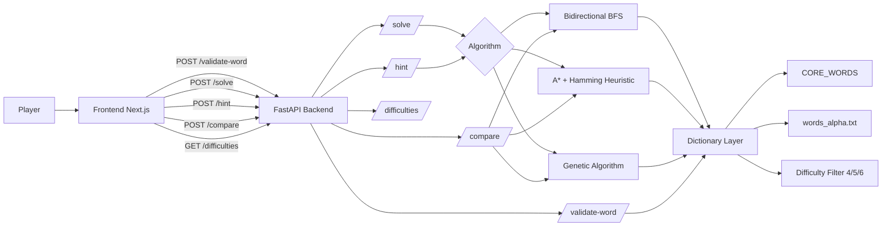
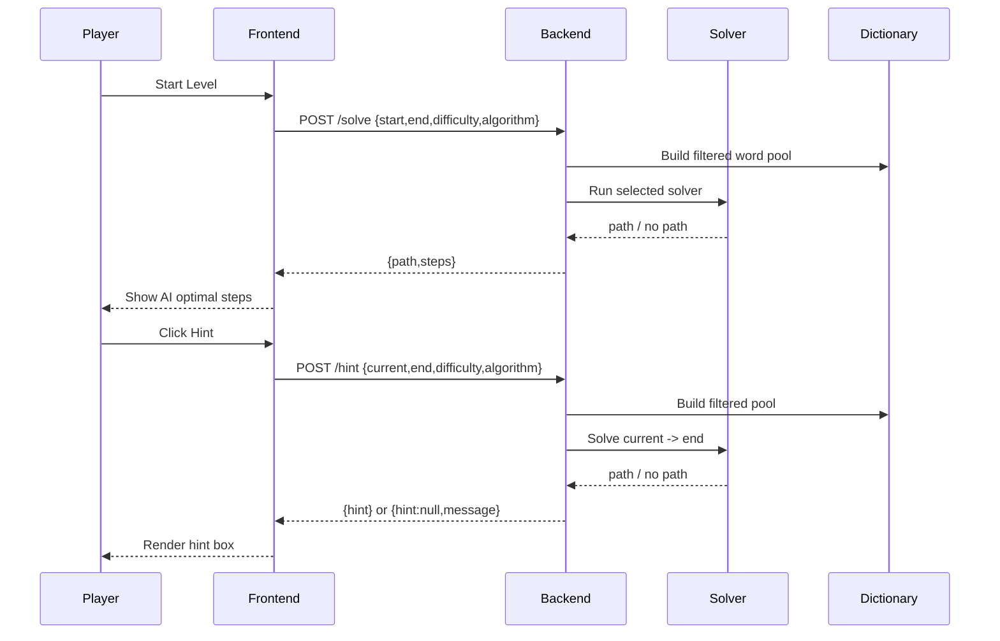
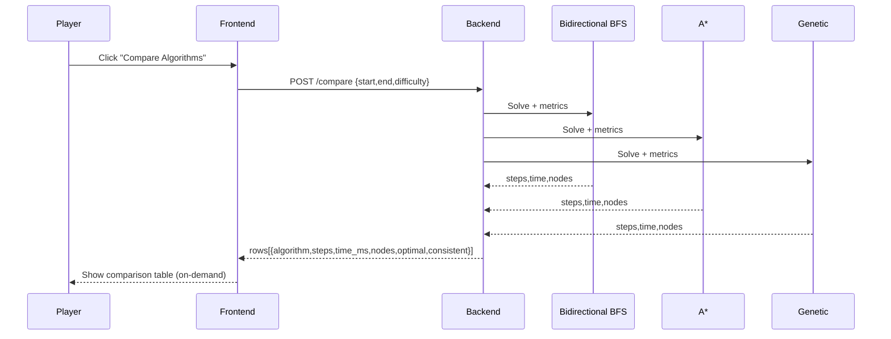

# Word Jungle AI System Report

## 1) Project Overview

Word Jungle is a word-ladder puzzle game where a player transforms a start word into a target word by changing one letter at a time.

Your current version includes:
- FastAPI backend (`backend/main.py`)
- Dictionary loader + core words (`backend/dictionary.py`)
- Multiple solvers (`backend/solver.py`)
- Next.js frontend (`app/page.tsx`, `lib/word-service.ts`)

---

## 2) AI Concepts Used

### A) Classical State-Space Search
- Problem is modeled as a graph:
  - Node = valid word
  - Edge = one-letter valid transformation

### B) Bidirectional BFS
- Searches from start and end simultaneously.
- Meets in the middle to reduce search space.
- Deterministic and optimal for unweighted edges.

### C) A* (Heuristic Search)
- Uses `f(n) = g(n) + h(n)`.
- `h(n)` is Hamming distance (letter mismatch count with target).
- Faster guidance toward target on many puzzles.
- Deterministic and optimal when heuristic is admissible (as implemented).

### D) Genetic Algorithm (Evolutionary AI)
- Population of candidate paths.
- Fitness based on closeness to target.
- Uses selection, crossover, and mutation.
- Stochastic and not guaranteed globally optimal.

### E) Constraint Filtering (Difficulty)
- Before solving, dictionary is filtered by word length:
  - Easy: 4 letters
  - Medium: 5 letters
  - Hard: 6 letters
  - Any: no filter

---

## 2.1 Visual Architecture (Mermaid)



---

## 3) Endpoints and Their Role

### Existing
- `GET /health` -> backend status
- `POST /validate-word` -> checks dictionary membership

### Added
- `POST /solve`
  - Input: `{ start, end, difficulty, algorithm }`
  - Output: shortest/available path + step count
- `POST /hint`
  - Input: `{ current, end, difficulty, algorithm }`
  - Output: next suggested word
- `GET /difficulties`
  - Output: available difficulty values
- `POST /compare`
  - Input: `{ start, end, difficulty }`
  - Output: comparison table rows for all algorithms:
    - `Steps`, `Time(ms)`, `Nodes`, `Optimal`, `Consistent`

---

## 4) Runtime Flow (What Happens After What)

## 4.1 Game Start
1. User picks difficulty and algorithm on the frontend.
2. User starts a level (`start`, `end` are known from level data).
3. Frontend calls `POST /solve`.
4. Backend:
   - Normalizes words to uppercase.
   - Applies difficulty filter to `WORDS`.
   - Runs selected solver (`bidirectional`, `astar`, or `genetic`).
5. Backend returns `path` and `steps`.
6. Frontend stores and displays `AI optimal: X steps`.

## 4.2 Player Move Validation
1. User enters next word.
2. Frontend validates:
   - Correct length
   - Not previously used
   - One-letter difference from current word
3. Frontend calls backend `POST /validate-word` (with local fallback).
4. If valid -> chain is updated and move counter increments.

## 4.3 Hint Request
1. User clicks **Hint**.
2. Frontend calls `POST /hint` with current word and target.
3. Backend runs selected solver from current -> target.
4. Returns second node in path (`path[1]`) as hint.
5. Frontend shows hint in hint box (does not auto-play move).

## 4.4 Algorithm Comparison (On-Demand)
1. User clicks **Compare Algorithms**.
2. Frontend calls `POST /compare` for current level.
3. Backend runs all three algorithms with metric wrappers.
4. Backend returns table rows with:
   - Steps
   - Time (ms)
   - Nodes
   - Optimal (best steps among returned)
   - Consistent (deterministic vs stochastic)
5. Frontend renders comparison chart/table only when requested.

---

## 4.5 Solve + Hint Sequence (Mermaid)



---

## 4.6 Comparison Endpoint Sequence (Mermaid)



---

## 5) Dictionary System

`backend/dictionary.py` builds final `WORDS` set as:
1. `CORE_WORDS` (hardcoded puzzle-critical words)
2. Words loaded from `words_alpha.txt`
   - Uppercased
   - Filtered to lengths 4/5/6
3. Union operation: `WORDS = CORE_WORDS | _file_words`

This keeps legacy puzzle words while allowing large-scale expansion.

---

## 6) Frontend UX Features

- AI optimal move count shown during gameplay
- Live player move counter with color states
- Hint button + hint display box
- Difficulty selector
- Algorithm selector (`Bidirectional BFS`, `A*`, `Genetic`)
- On-demand algorithm comparison table

---

## 7) Production/Deployment Notes

- CORS uses env-based config:
  - `ALLOWED_ORIGINS = os.getenv("ALLOWED_ORIGINS", "*").split(",")`
- For production, set a specific frontend origin in environment.

---

## 8) How to Run

### Backend
```powershell
cd "c:\Users\samru\Downloads\Word jungle\Word jungle\backend"
python -m venv .venv
.\.venv\Scripts\Activate.ps1
pip install -r requirements.txt
uvicorn main:app --reload --host 127.0.0.1 --port 8000
```

### Frontend
```powershell
cd "c:\Users\samru\Downloads\Word jungle\Word jungle"
$env:NEXT_PUBLIC_API_BASE_URL="http://127.0.0.1:8000"
npm install
npm run dev
```

---

## 9) Suggested Future Enhancements

- Add retry averaging for Genetic algorithm metrics in `/compare` (stability)
- Add CSV/PDF export for comparison table
- Add caching for repeated solve/hint requests on same level
- Add benchmark mode across all levels

